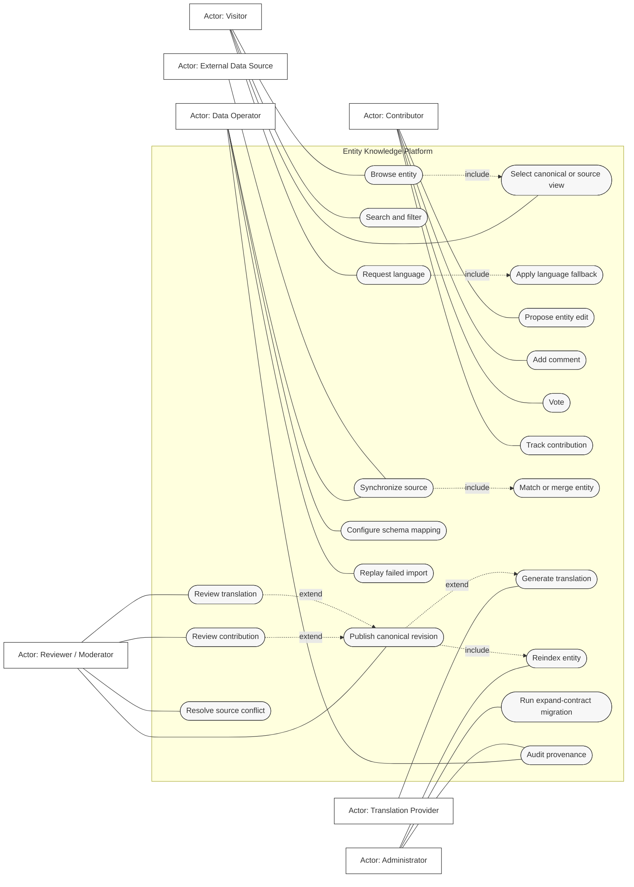
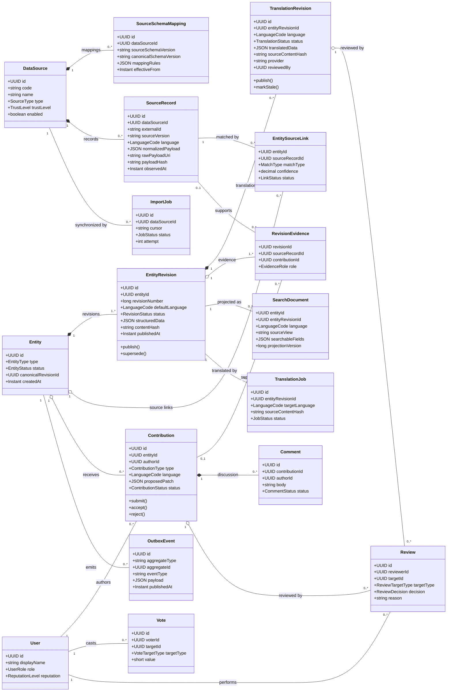
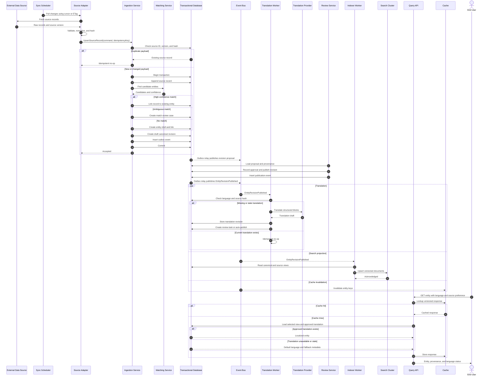
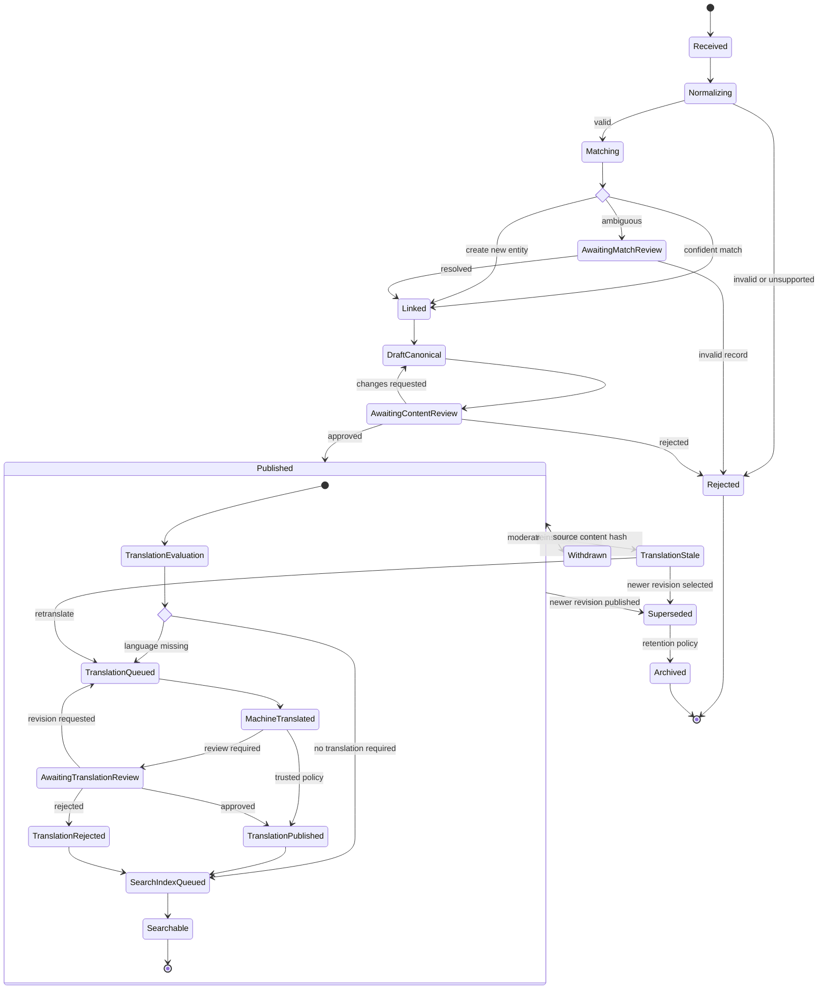
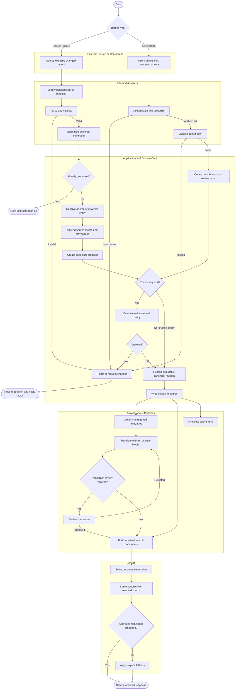
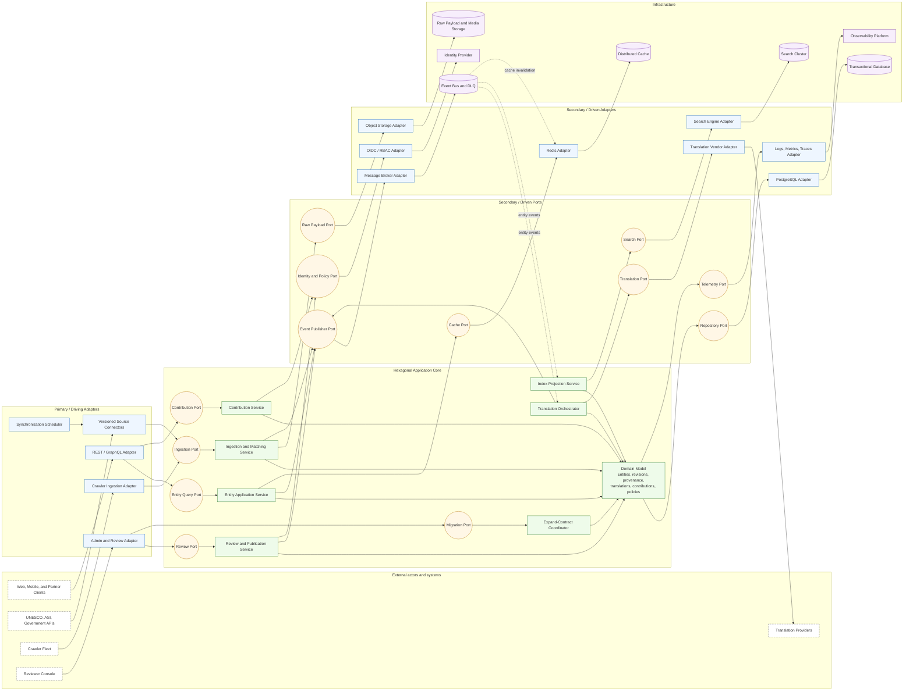
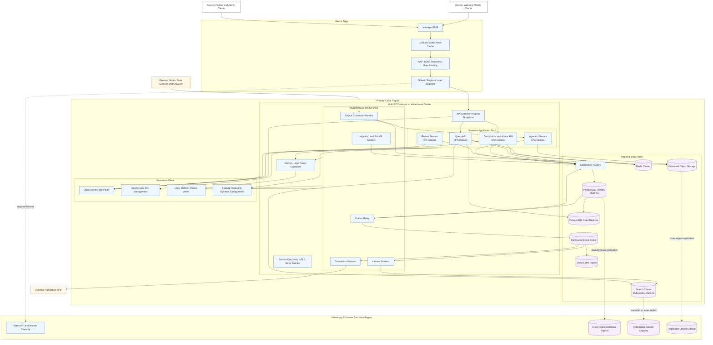

# Backend Server Database Design

## 1. Purpose

This document defines a scalable backend for indexing places, historical sites, and related entities from heterogeneous sources such as UNESCO, ASI, government bodies, crawlers, and direct user contributions.

The design uses:

- **Hexagonal architecture (Ports and Adapters)** to isolate domain rules from databases, APIs, brokers, translation vendors, and search engines.
- **Expand-contract migrations** to evolve schemas, adapters, APIs, and indexes without a disruptive cutover.
- **Immutable source provenance** and versioned canonical entity revisions.
- **Asynchronous, idempotent pipelines** for ingestion, translation, review, and indexing.

> Mermaid is used for portability. Flowcharts express UML concepts where Mermaid has no dedicated UML syntax.

## 2. Core Design Rules

1. Preserve every source representation independently.
2. Link multiple source records to one universal `Entity`.
3. Publish immutable canonical revisions derived from source evidence and accepted contributions.
4. Bind every translation to an exact source revision and content hash.
5. Treat search indexes and caches as rebuildable projections.
6. Make ingestion commands and asynchronous consumers idempotent.
7. Keep the application core dependent only on ports, never infrastructure implementations.
8. Apply schema changes through expand, migrate, and contract deployments.

# 3. UML Diagrams

## 3.1 Use Case Diagram



## 3.2 Class Diagram



### Persistence constraints

- Unique source version: `(data_source_id, external_id, source_version)`.
- Unique canonical revision: `(entity_id, revision_number)`.
- One vote per `(voter_id, target_type, target_id)`.
- Translation identity includes `(entity_revision_id, language, source_content_hash)`.
- Use optimistic concurrency when changing `canonicalRevisionId`.
- Keep raw source payloads in object storage with an immutable URI and checksum.


## 3.3 Sequence Diagram

The sequence covers an upstream update, canonical publication, translation, indexing, and a subsequent user read.



### Sequence guarantees

- Derive ingestion idempotency from source, external ID, source version, and payload hash.
- Commit publication state and its outbox event in one transaction.
- Deduplicate consumers by event ID and monotonic projection version.
- Search and cache are eventually consistent; the transactional database is authoritative.
- Responses identify approved, machine-generated, stale, and fallback translations.

## 3.4 Statechart Diagram

This models the lifecycle of a canonical entity revision and localized publication.



### State rules

- Published revisions are immutable; corrections create a new revision.
- A translation can be published only when its source hash matches the relevant revision.
- Withdrawn revisions remain auditable but are excluded from normal reads and indexes.
- Publishing a newer revision supersedes the previous one and invalidates dependent projections.

## 3.5 Activity Diagram




## 3.6 Component Diagram



### Component responsibilities

| Component | Responsibility |
|---|---|
| Source connectors | Convert source-specific contracts into versioned universal ingestion commands |
| Ingestion and matching | Deduplicate, version, match, preserve provenance, and create proposals |
| Entity service | Compose canonical/source views and language fallback |
| Contribution service | Accept edits, comments, and votes and initiate workflows |
| Review service | Resolve conflicts, record decisions, and publish revisions |
| Translation orchestrator | Track demand, translate blocks, detect staleness, and route review |
| Index projection service | Build source- and language-specific search documents |
| Migration coordinator | Control expand, backfill, read switch, validation, and contract |
| Repository adapter | Persist authoritative transactional state |
| Broker adapter | Decouple publication from translation, indexing, and invalidation |

**Dependency rule:** dependencies point inward. The domain and application components depend on port interfaces; infrastructure adapters implement those ports.

## 3.7 Deployment Diagram



### Deployment notes

- APIs are stateless and horizontally scalable.
- Query and command workloads scale and deploy independently.
- Read replicas absorb entity and provenance reads; the primary handles publication transactions.
- Partition broker events by `entity_id` to preserve per-entity order while retaining parallelism.
- Raw imports and replay artifacts live in versioned object storage.
- Search and cache are reconstructable; disaster recovery prioritizes the transactional database and immutable objects.
- Use workload identities and short-lived credentials rather than secrets embedded in containers.


# 4. Database and Storage Design

## 4.1 Logical schemas

```text
identity
  users
  roles
  user_reputation

catalog
  entities
  entity_revisions
  entity_source_links
  revision_evidence

sources
  data_sources
  source_schema_mappings
  source_records
  import_jobs
  import_failures

localization
  translation_revisions
  translation_jobs
  language_demand

community
  contributions
  comments
  votes
  reviews

operations
  outbox_events
  idempotency_keys
  migration_runs
  audit_log
```

These can initially share one PostgreSQL cluster while preserving ownership boundaries. Split them only when measured load or team ownership justifies the operational cost.

## 4.2 Important indexes

| Table | Suggested index |
|---|---|
| `source_records` | Unique `(data_source_id, external_id, source_version)` |
| `source_records` | `(data_source_id, payload_hash)` |
| `entity_source_links` | `(source_record_id, status)` and `(entity_id, status)` |
| `entity_revisions` | Unique `(entity_id, revision_number)` |
| `entity_revisions` | Partial `(entity_id, published_at DESC)` for published rows |
| `translation_revisions` | `(entity_revision_id, language, status)` |
| `contributions` | `(entity_id, status, created_at)` |
| `reviews` | `(target_type, target_id, created_at)` |
| `outbox_events` | Partial `(occurred_at)` where `published_at IS NULL` |
| `idempotency_keys` | Unique `(scope, key)` with expiration |
| `import_jobs` | `(data_source_id, status, started_at)` |

Use geospatial database indexes for exact point/polygon operations. Keep broad multilingual full-text relevance in the search engine rather than adding an unbounded set of transactional indexes.

# 5. Translation Pipeline

Represent content as stable semantic blocks:

```json
{
  "block_id": "history.summary",
  "source_language": "hi",
  "source_text": "...",
  "source_hash": "sha256:...",
  "do_not_translate": ["ASI", "Qutub Minar"],
  "format": "markdown"
}
```

Translate and review per block, then assemble a localized revision. This avoids retranslating unchanged paragraphs.

Suggested language resolution:

1. Approved translation of the selected canonical or source revision.
2. Approved configured fallback locale.
3. Selected representation's default language.
4. Canonical default language.
5. Explicit `translation_pending` metadata.

A translation is current only when:

```text
translation.source_content_hash == source_revision.content_hash
```

When the source changes, mark dependent translations stale, preserve them for audit and translation-memory reuse, and enqueue only changed blocks.

# 6. Contribution and Moderation

Contributions are proposed changes, not direct mutations of published content.

Recommended controls:

- authenticated authorship and immutable audit records;
- reputation-based review routing;
- spam and abuse screening;
- one active vote per user and target;
- optimistic locking when multiple reviewers act;
- structured patches instead of arbitrary full-document replacement;
- reason codes for acceptance, rejection, withdrawal, and rollback;
- provenance links from accepted contributions to resulting revisions.

Comments and votes influence review and ranking policy but should not automatically become canonical facts without a recorded decision.

# 7. Indexer Pipeline

A search document should contain:

- entity identity and type;
- canonical and source-specific names;
- approved localized text;
- geospatial fields;
- source identifiers and attribution;
- normalized tags and categories;
- publication and moderation status;
- source trust and freshness signals;
- canonical revision and projection version.

Use alias-based index deployment:

1. Build a new versioned index.
2. Backfill from authoritative revisions or replay events.
3. Validate counts, checksums, and representative queries.
4. Atomically switch the read alias.
5. Retain the previous index for rollback.
6. Delete it after the rollback window.

# 8. Expand-Contract Migration Strategy

Use separate deployments for each phase.

## Expand

- Add new nullable columns, tables, event fields, or API fields.
- Deploy code that understands old and new representations.
- Start dual-writing where required.
- Add metrics for both paths.
- Never remove or rename a live field in place.

## Migrate

- Backfill in resumable, idempotent batches.
- Throttle using database load and replication lag.
- Compare row counts, checksums, invariants, and business results.
- Move reads gradually behind a feature flag.
- Preserve rollback capability.

## Contract

- Stop old writes.
- Verify that no consumers use the old representation.
- Remove compatibility code.
- Remove old schema and indexes in a later deployment.
- Record migration evidence in `migration_runs`.

Example:

| Phase | Replacing one description column with localized blocks |
|---|---|
| Expand | Add content-block tables and continue writing the old column |
| Migrate | Dual-write, backfill, validate hashes, and switch reads |
| Contract | Stop old writes, remove the old reader, then drop the column |

# 9. Reliability, Scalability, Security, and Observability

## Reliability

- Transactional outbox for reliable event publication.
- Idempotency keys on ingestion and contribution commands.
- Consumer deduplication and monotonic projection versions.
- Exponential backoff, jitter, retry limits, and dead-letter queues.
- Per-source circuit breakers and rate limits.
- Replay tools for raw payloads, event ranges, and failed jobs.
- Point-in-time database recovery and versioned object storage.

## Scalability

- Stateless APIs and horizontally scalable workers.
- Independent scaling for reads, ingestion, translation, and indexing.
- Broker partitioning by entity or source.
- Revision-aware cache keys.
- Read replicas for high-volume detail queries.
- Cursor-based source synchronization.
- Batch translation and index writes where supported.

## Security

- OIDC authentication and role- or attribute-based authorization.
- Source credentials in a secrets manager.
- Authenticated service-to-service communication.
- Encryption in transit and at rest.
- Parser hardening and request-size limits.
- HTML and Markdown sanitization.
- Immutable moderation and migration audit trails.
- Licensing and attribution enforced as domain policy.

## Observability

Track:

- ingestion lag, rejection rate, and deduplication rate;
- records awaiting entity-match review;
- canonical publication latency;
- translation queue depth, cost, status, and staleness;
- index projection lag and failed documents;
- cache hit ratio;
- database latency, lock time, saturation, and replica lag;
- outbox age and broker consumer lag;
- migration progress and invariant failures;
- moderation turnaround time.

# 10. Architecture Decision Summary

| Decision | Benefit | Cost |
|---|---|---|
| Immutable source and canonical revisions | Auditability, rollback, provenance | Increased storage |
| Universal schema behind adapters | Isolates source schema churn | Mapping governance |
| Hexagonal architecture | Testable domain and replaceable infrastructure | More interfaces |
| Async translation and indexing | Independent scaling and low write latency | Eventual consistency |
| Transactional outbox | Reliable downstream publication | Relay and cleanup |
| Block-level translation | Lower cost and focused review | Content decomposition |
| Search as projection | Fast multilingual/geospatial queries | Rebuild and lag handling |
| Expand-contract | Backward-compatible evolution | Multiple releases |
| Raw payload archive | Replay after mapping changes | Retention cost |
| Canonical plus source views | Curation without hiding provenance | More complex reads |

# 11. Requirements Traceability

| Requirement | Design elements |
|---|---|
| Millions of users | CDN, cache, stateless APIs, read replicas, search cluster |
| Multiple changing sources | Versioned adapters, schema mappings, raw payload archive |
| Universal database | Canonical entities separate from source records |
| Future migrations | Ports and adapters plus expand-contract coordinator |
| Multiple entries per entity | Entity-source links, matching, and revision evidence |
| Platform-curated version | Immutable canonical revisions and review workflow |
| Selectable source | Query service composes canonical or source-specific view |
| Translation pipeline | Block hashes, jobs, provider port, review, and staleness |
| Contribution pipeline | Contributions, comments, votes, reviews, and audit |
| Frequent queries | Search documents, cache, and read replicas |
| Robust processing | Idempotency, outbox, retries, DLQ, and replay |
| Scalable deployment | Multi-AZ services, workers, broker, storage, and DR |

# 12. References

- IBM Developer, *An introduction to the Unified Modeling Language*:  
  https://developer.ibm.com/articles/an-introduction-to-uml/
- IBM Developer, *The component diagram*:  
  https://developer.ibm.com/articles/the-component-diagram/
- Sparx Systems, *Database Modeling in UML*:  
  https://sparxsystems.com/resources/tutorials/uml/datamodel.html
- Alistair Cockburn, *Hexagonal Architecture*:  
  https://alistair.cockburn.us/hexagonal-architecture
- Martin Fowler, *Parallel Change*:  
  https://martinfowler.com/bliki/ParallelChange.html
