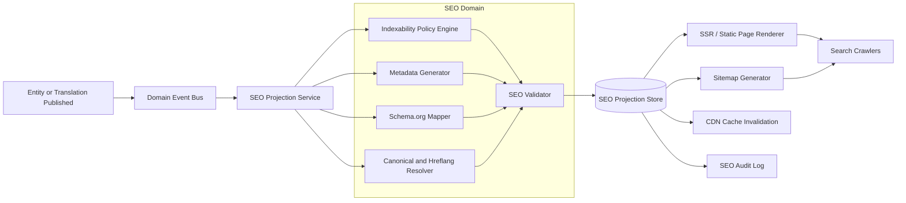
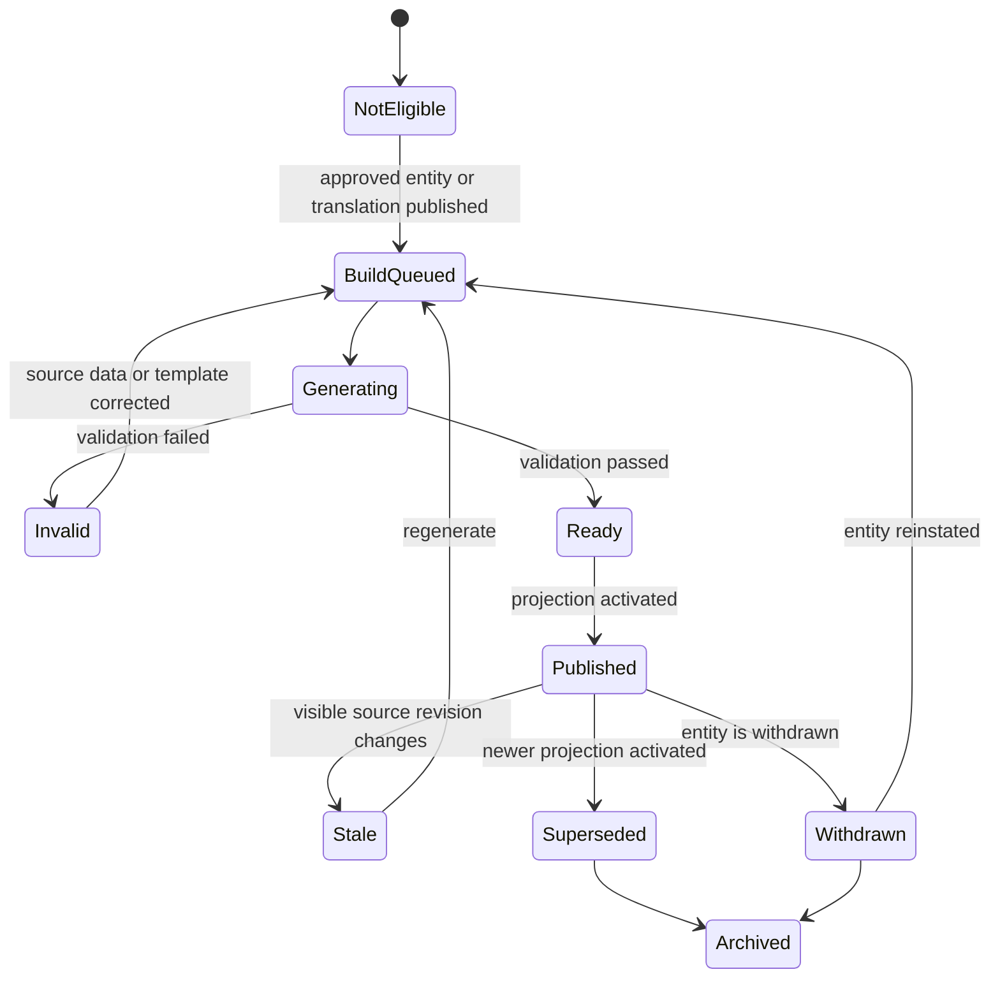

# SEO Optimisation & Adaptor Design

## 1. Purpose

This document defines the search-engine optimisation strategy for a large, multilingual platform that publishes places, historical sites, cultural entities, source-specific records, translations, and user-contributed content.

The design covers:

- technical SEO;
- multilingual and international SEO;
- Schema.org and JSON-LD;
- dynamic SEO generation;
- crawl and index management;
- content quality and provenance;
- user-generated content controls;
- image SEO;
- performance and Core Web Vitals;
- monitoring, governance, and rollout.

The platform’s internal canonical model remains the system of record. SEO metadata is produced as a versioned external projection from approved entity revisions and translations.

---

## 2. Goals

1. Make approved entities easy for search engines to discover, render, understand, and index.
2. Publish one clear primary URL for each indexable entity and language.
3. prevent duplicate source views, filters, and fallback translations from creating crawl waste.
4. Represent places and historical sites with accurate Schema.org JSON-LD.
5. Generate SEO metadata dynamically without introducing unstable or misleading output.
6. Support millions of pages and frequent content updates.
7. Preserve content quality, provenance, contributor attribution, and moderation controls.
8. Measure SEO performance as a product capability rather than a one-time implementation.

## 3. Non-goals

- Guaranteeing a particular ranking or rich-result appearance.
- Using Schema.org as the operational database schema.
- Publishing every source record, translation draft, search filter, or user contribution as an indexable page.
- Creating location-and-keyword pages whose primary purpose is manipulating rankings.
- Serving a special, materially different page only to crawlers.

---

# 4. SEO Principles

## 4.1 People-first content

SEO should make useful content easier to find. It must not replace editorial quality, accurate facts, meaningful localisation, provenance, or a good user experience.

Each entity page should answer genuine user needs, such as:

- What is this place?
- Why is it historically or culturally significant?
- Where is it?
- What is its original and current name?
- Which authorities or sources describe it?
- When was the information last reviewed?
- Which language and source representation is being displayed?
- What other relevant places or historical entities are related?

## 4.2 The canonical entity is the primary search page

The platform may preserve multiple representations from UNESCO, ASI, other authorities, crawlers, and users. The default SEO policy should expose the curated canonical entity as the primary indexable page.

Source-specific views should remain available to users, but they should not automatically become separate search pages when their content substantially duplicates the canonical page.

## 4.3 Approved content only

Only content that satisfies publication and quality policies should be indexable.

Drafts, unresolved source matches, pending reviews, failed imports, unreviewed translations, withdrawn content, and internal workflow screens should not enter sitemaps or normal search indexing.

## 4.4 Deterministic metadata

SEO output must be reproducible from:

- the published entity revision;
- the published translation revision;
- the entity type and taxonomy;
- the source-view policy;
- the SEO template version;
- the platform’s indexability rules.

Avoid generating production metadata with an unconstrained model during each request. AI may create offline suggestions, but those suggestions should pass deterministic validation and, where necessary, human review.

---

# 5. Dynamic SEO

## 5.1 Definition

In this design, **dynamic SEO** means generating and updating page-level SEO assets from versioned content and product rules.

It includes dynamically producing:

- the page title;
- meta description;
- canonical URL;
- robots directives;
- language alternates;
- Schema.org JSON-LD;
- Open Graph and social metadata;
- sitemap membership and `lastmod`;
- image metadata;
- breadcrumb data;
- indexability status.

Dynamic SEO does **not** mean “dynamic rendering” that sends a special pre-rendered version only to crawlers. Public entity pages should use server-side rendering, static rendering, or an equivalent hydration architecture so that essential content and metadata are available in the initial HTML.

## 5.2 Recommended architecture



## 5.3 Event triggers

Rebuild an SEO projection when any search-visible input changes:

- canonical entity revision published;
- approved translation published;
- translation marked stale;
- entity slug changed;
- entity taxonomy changed;
- primary image changed;
- source visibility policy changed;
- entity withdrawn or reinstated;
- organisation/site metadata changed;
- SEO template version released.

Do not rebuild SEO output for non-visible events such as a page view, internal analytics update, or unrelated vote.

## 5.4 Suggested SEO projection model

```sql
seo_documents (
    id                  uuid primary key,
    entity_id           uuid not null,
    entity_revision_id  uuid not null,
    translation_id      uuid null,
    locale              varchar(35) not null,
    source_view         varchar(100) not null,
    route_type          varchar(50) not null,

    index_status        varchar(30) not null,
    robots_directive    varchar(100) not null,

    title               text not null,
    meta_description    text null,
    canonical_url       text not null,
    hreflang_map        jsonb not null,

    json_ld             jsonb not null,
    open_graph          jsonb not null,
    breadcrumb_data     jsonb not null,

    content_hash        varchar(100) not null,
    template_version    integer not null,
    validation_status   varchar(30) not null,
    validation_errors   jsonb not null,

    generated_at        timestamptz not null,
    published_at        timestamptz null,

    unique (
        entity_revision_id,
        locale,
        source_view,
        template_version
    )
);
```

The renderer reads an approved SEO document rather than independently recreating metadata. This prevents inconsistent canonical URLs, language tags, structured data, and titles across application instances.

## 5.5 Dynamic SEO lifecycle



## 5.6 Failure behaviour

- Never publish malformed JSON-LD.
- Never publish an empty title.
- Never generate a canonical URL outside an allowed host.
- Never include a draft or private URL in `hreflang`.
- If optional metadata fails, serve the approved content with safe defaults.
- If indexability cannot be determined, default to the conservative state configured for that route.
- Alert on high-volume validation failures rather than silently publishing inconsistent metadata.

---

# 6. URL and Information Architecture

## 6.1 Recommended URL pattern

Use stable, readable, language-specific paths:

```text
/{language}/places/{stable-slug}
/{language}/historical-sites/{stable-slug}
/{language}/destinations/{stable-slug}
/{language}/countries/{country-slug}
/{language}/regions/{region-slug}
/{language}/categories/{category-slug}
```

Examples:

```text
/en/historical-sites/taj-mahal
/hi/historical-sites/taj-mahal
/fr/historical-sites/taj-mahal
```

The database identifier should remain stable even if the display name or slug changes.

## 6.2 Slug changes

When a published slug changes:

1. Create a permanent redirect from the old URL.
2. Update internal links.
3. Update canonical and `hreflang` mappings.
4. Update the relevant sitemap entries.
5. Keep a redirect registry to avoid chains.
6. Redirect directly from every historic slug to the current URL.

## 6.3 Query parameters

Avoid creating indexable variants for:

- sorting;
- map viewport;
- tracking parameters;
- UI state;
- source selector parameters;
- temporary filters;
- session identifiers.

Prefer path-based URLs for curated, search-worthy landing pages. Normalise or canonicalise parameter variants and keep infinite filter combinations out of sitemaps.

## 6.4 Curated landing pages

Create indexable taxonomy pages only when they provide substantial value, such as:

- UNESCO sites in India;
- historical sites in Rajasthan;
- Buddhist heritage sites;
- accessible museums in London;
- monuments from a defined historical period.

Each landing page should include useful editorial context, a stable selection criterion, crawlable links, and sufficient unique content. Do not mass-publish thin combinations of every location, category, and keyword.

---

# 7. Indexability Policy

## 7.1 Default matrix

| Page state or type | Indexing policy | Sitemap | Canonical policy |
|---|---|---:|---|
| Published canonical entity | `index,follow` | Yes | Self-canonical |
| Approved, fully translated entity | `index,follow` | Yes | Self-canonical in the same language |
| Untranslated locale fallback | Not indexable until meaningful translation exists | No | Point to the original-language page or redirect according to product policy |
| Source-specific duplicate view | Usually not a separate index target | No | Canonical to the primary entity page |
| Materially distinct authoritative source page | Case-by-case | Only if approved | Self-canonical when it provides unique user value |
| Draft or pending review | `noindex,nofollow` or authentication | No | None required |
| Withdrawn entity | `noindex` while retained, or appropriate removal status | No | Remove from active canonical graph |
| Internal search results | Usually `noindex,follow` | No | Self or omitted, depending on routing |
| Infinite facets and sort variants | Prevent crawl expansion | No | Normalised parent page where appropriate |
| Curated category/location page | `index,follow` | Yes | Self-canonical |
| Contributor profile with insufficient public value | `noindex,follow` | No | Self |
| Approved editorial article | `index,follow` | Yes | Self-canonical |

Do not use `noindex` merely as a substitute for proper duplicate-URL consolidation. Use canonicalisation, redirects, consistent internal links, and clean URL generation for duplicate variants.

## 7.2 Publication threshold

An entity should become indexable only after meeting a minimum quality threshold, for example:

- approved name;
- valid entity type;
- usable description or structured facts;
- valid geographic relationship where relevant;
- source attribution;
- no unresolved moderation block;
- approved default-language revision;
- valid canonical URL;
- valid structured data;
- no prohibited or private fields.

A thin record containing only an identifier and a name may be useful internally but does not necessarily justify a public search page.

---

# 8. Multilingual and International SEO

## 8.1 One URL per language

Each approved translation should have a distinct URL. Avoid changing page language solely through cookies or request headers while keeping the same URL.

Each language page should:

- render its own translated main content;
- use a title and description in the same language and writing system;
- use a self-referencing canonical URL;
- link to all approved alternates;
- declare an appropriate HTML `lang` value;
- appear in the correct locale sitemap;
- use translated breadcrumbs and internal anchor text.

## 8.2 `hreflang`

Generate reciprocal language alternates from the same SEO projection.

Example:

```html
<link rel="alternate" hreflang="en"
      href="https://example.com/en/historical-sites/taj-mahal">

<link rel="alternate" hreflang="hi"
      href="https://example.com/hi/historical-sites/taj-mahal">

<link rel="alternate" hreflang="fr"
      href="https://example.com/fr/historical-sites/taj-mahal">

<link rel="alternate" hreflang="x-default"
      href="https://example.com/historical-sites/taj-mahal">
```

Rules:

- Every listed language page includes itself.
- Alternate pages reference one another.
- Only approved, publicly reachable translations appear.
- Language and region codes follow supported conventions.
- Use `x-default` for a neutral selector or fallback page when appropriate.
- Do not publish `hreflang` to a redirect, error page, draft, or non-canonical URL.

For a very large language set, language alternates may be represented in XML sitemaps rather than duplicating large lists in every page head. Use one canonical implementation source to avoid inconsistent mappings.

## 8.3 Translation publication rules

Machine translation may be used as a draft, but it should not automatically create millions of indexable pages without quality controls.

Recommended gates:

- language detection passes;
- required fields translated;
- names and protected terms preserved correctly;
- markup and links remain valid;
- geographic and historical facts are unchanged;
- glossary rules pass;
- no prohibited content introduced;
- confidence or review threshold passes;
- translated content is materially present, not only translated navigation.

## 8.4 Fallback behaviour

When the requested language is unavailable:

- show the original-language content with a clear notice;
- allow the user to request or contribute a translation;
- do not present fallback content as an approved translation;
- avoid indexing a separate language URL whose main content remains untranslated.

---

# 9. Titles and Meta Descriptions

## 9.1 Title generation

Every indexable page needs a concise, descriptive, language-appropriate `<title>`.

Suggested templates:

```text
Entity:
{name}: History, Significance and Location | {site_name}

Place with strong location intent:
{name}, {locality}: History and Visitor Information | {site_name}

Curated collection:
{category_name} in {region_name} | {site_name}
```

Rules:

- Use the exact approved entity name.
- Keep the title aligned with the visible H1.
- Avoid keyword repetition and boilerplate.
- Avoid inserting fields that are missing or unverified.
- Do not append every taxonomy term.
- Use the primary language and writing system of the page.
- Keep the site name consistent.
- Change the template by entity type only when it improves clarity.

Google may generate a different title link from the page’s content, headings, links, or other signals. The objective is a strong, accurate preference—not absolute control.

## 9.2 Meta-description generation

A description should be a concise, page-specific summary based on approved visible content.

Example rule:

```text
{short_summary} Located in {location}, {name} is known for
{primary_significance}. Explore its history, sources, images,
and verified visitor information.
```

Rules:

- Generate a unique description for each indexable page.
- Use only facts visible on the page.
- Do not include unverified opening times, prices, or dates.
- Avoid lists of keywords.
- Localise the description rather than translating a generic template alone.
- Allow an editor to override generated text.
- Keep the metadata revisioned with the entity revision.

Search engines may select a snippet from the visible page instead of the meta description, so the opening content should also provide a strong summary.

## 9.3 Heading structure

- One clear primary H1 for the entity or landing page.
- Logical H2 sections such as History, Significance, Architecture, Location, Sources, and Visitor Information.
- Do not use headings merely for visual styling.
- Keep the H1, title, breadcrumbs, and structured-data name semantically aligned.

---

# 10. Schema.org and JSON-LD

## 10.1 Role in the system

Schema.org is an outbound semantic representation. It should be generated from the internal canonical model through an SEO adapter.

Recommended base types include:

| Domain entity | Schema.org approach |
|---|---|
| General physical place | `Place` |
| Historical landmark or building | `LandmarksOrHistoricalBuildings` |
| Visitor attraction | `TouristAttraction` or an appropriate `additionalType` |
| Destination containing attractions | `TouristDestination` |
| Geographic coordinates | `GeoCoordinates` |
| Address | `PostalAddress` |
| Page hierarchy | `BreadcrumbList` |
| Platform owner | `Organization` |
| Website identity | `WebSite` |
| Editorial article about a place | `Article` or a suitable subtype |
| Image | `ImageObject` where useful |

Schema.org vocabulary and Google rich-result eligibility are not the same thing. A valid Schema.org type can improve semantic clarity without producing a special rich result. Implement only accurate properties and separately check Google’s supported search features.

## 10.2 Recommended graph

```json
{
  "@context": "https://schema.org",
  "@graph": [
    {
      "@type": "WebPage",
      "@id": "https://example.com/en/historical-sites/taj-mahal#webpage",
      "url": "https://example.com/en/historical-sites/taj-mahal",
      "name": "Taj Mahal: History, Significance and Location",
      "inLanguage": "en",
      "mainEntity": {
        "@id": "https://example.com/entity/018f...#place"
      },
      "breadcrumb": {
        "@id": "https://example.com/en/historical-sites/taj-mahal#breadcrumb"
      }
    },
    {
      "@type": [
        "Place",
        "LandmarksOrHistoricalBuildings",
        "TouristAttraction"
      ],
      "@id": "https://example.com/entity/018f...#place",
      "name": "Taj Mahal",
      "description": "Approved description visible on the page.",
      "url": "https://example.com/en/historical-sites/taj-mahal",
      "geo": {
        "@type": "GeoCoordinates",
        "latitude": 27.1751,
        "longitude": 78.0421
      },
      "identifier": [
        {
          "@type": "PropertyValue",
          "propertyID": "UNESCO",
          "value": "252"
        }
      ],
      "sameAs": [
        "https://whc.unesco.org/en/list/252/"
      ],
      "image": {
        "@type": "ImageObject",
        "url": "https://cdn.example.com/images/taj-mahal/main.jpg",
        "caption": "Approved image caption"
      }
    },
    {
      "@type": "BreadcrumbList",
      "@id": "https://example.com/en/historical-sites/taj-mahal#breadcrumb",
      "itemListElement": [
        {
          "@type": "ListItem",
          "position": 1,
          "name": "Historical Sites",
          "item": "https://example.com/en/historical-sites"
        },
        {
          "@type": "ListItem",
          "position": 2,
          "name": "Taj Mahal",
          "item": "https://example.com/en/historical-sites/taj-mahal"
        }
      ]
    }
  ]
}
```

## 10.3 Structured-data rules

- Prefer JSON-LD.
- Generate markup server-side with the HTML.
- Mark up only information visible or directly supported by the page.
- Keep identifiers, coordinates, names, images, and dates consistent with visible content.
- Use stable `@id` values independent of translated slugs.
- Use `sameAs` for authoritative identity-equivalent URLs, not every page that mentions the entity.
- Do not mark contributor votes as ratings unless they semantically satisfy the relevant rating model and platform policy.
- Validate during build, deployment, and production monitoring.
- Version the mapper so schema changes can use expand-contract rollout.

---

# 11. Source-Specific Views

Users may switch between the platform’s canonical version and records from UNESCO, ASI, or another source.

Recommended policy:

1. The canonical entity URL is the primary search target.
2. Source-specific content may be rendered in tabs, sections, or stable source-view URLs.
3. A source-view URL that substantially duplicates the canonical page should:
   - remain outside sitemaps;
   - use the canonical entity URL as its canonical target;
   - avoid becoming the main internal-link destination.
4. A source page may be independently indexable only when it offers substantial unique content and user value.
5. Source attribution must remain visible regardless of indexability.
6. Source identifiers should be available in structured data where accurate.
7. Do not place canonical URLs behind transient query strings such as `?source=unesco`.

This approach preserves transparency without multiplying near-duplicate pages.

---

# 12. User-Generated Content SEO

## 12.1 Contributions

Draft contributions should not be indexable. Accepted contributions become evidence for a new published entity revision; the canonical page is then updated.

Avoid creating a public indexable URL for every minor edit or workflow event.

## 12.2 Comments

Comments may be crawlable as part of an entity page when they add useful moderated discussion, but they should not dominate the page’s title, description, structured data, or primary content.

Controls should include:

- spam detection;
- rate limiting;
- moderation;
- language detection;
- link limits;
- duplicate detection;
- abuse reporting;
- reputation signals.

## 12.3 User-submitted links

Annotate untrusted user-submitted outbound links with an appropriate relationship such as `rel="ugc"` and, where policy requires, `nofollow`.

Do not allow comments or profiles to become a scalable link-spam surface.

## 12.4 Contributor pages

Index contributor profiles only when they provide genuine public value, such as verified expertise, meaningful authorship history, or editorial accountability. Thin, empty, private, or autogenerated profiles should remain non-indexable.

---

# 13. Internal Linking and Navigation

Search engines and users should be able to discover entities through crawlable HTML links.

Recommended hierarchy:

```text
Home
 ├── Countries
 │    └── Regions
 │         └── Cities / Areas
 │              └── Entities
 ├── Categories
 │    └── Entity collections
 ├── Historical periods
 │    └── Related entities
 └── Governing bodies / recognised collections
      └── Related entities
```

Practices:

- Use standard anchor elements with real `href` values.
- Add breadcrumbs to entity and collection pages.
- Link to parent location and taxonomy pages.
- Add a limited set of genuinely related entities.
- Use meaningful anchor text.
- Prevent orphan entities.
- Avoid massive site-wide link blocks.
- Ensure pagination and incremental loading have crawlable page URLs when the underlying collection should be indexed.
- Keep navigation available without requiring a user interaction that crawlers cannot reproduce.

---

# 14. Sitemaps and Crawl Efficiency

## 14.1 Sitemap design

Use a sitemap index with sharded sitemaps, for example:

```text
/sitemaps/index.xml
/sitemaps/entities-en-0001.xml
/sitemaps/entities-hi-0001.xml
/sitemaps/categories-en.xml
/sitemaps/images-0001.xml
```

Only include:

- canonical indexable URLs;
- approved translations;
- successful `200` pages;
- URLs whose canonical target is themselves.

Exclude:

- redirects;
- `noindex` pages;
- source duplicates;
- internal search results;
- filter combinations;
- untranslated fallback routes;
- drafts and withdrawn content.

Set `lastmod` only when the primary content, approved translation, structured facts, or other meaningful search-visible content changes. Do not update it because of page views or routine deployment timestamps.

## 14.2 Crawl-budget controls

For a platform with millions of frequently changing URLs:

- eliminate duplicate URL generation;
- use stable canonical paths;
- block infinite crawl spaces such as map coordinates, sort orders, and uncontrolled facets;
- return fast and correct status codes;
- keep sitemaps current;
- prevent soft 404 pages;
- remove broken internal links;
- limit redirect chains;
- prioritise important and recently changed entities in sitemap updates;
- monitor crawler activity and server response health.

Use `robots.txt` to manage crawler access, not as a guaranteed de-indexing mechanism. Use page-level `noindex` when a crawlable page must be excluded from search results.

## 14.3 HTTP status rules

| Situation | Response |
|---|---|
| Published entity | `200` |
| Permanent slug change | `301` or `308` |
| Temporary routing or language decision | `302` or `307` where appropriate |
| Entity never existed | `404` |
| Entity permanently removed with no replacement | `410` where appropriate |
| Temporary overload or maintenance | `503` with recovery controls |
| Rate limit | `429` |

Avoid returning `200` for missing entities.

---

# 15. Rendering and JavaScript SEO

Recommended rendering order:

1. Static generation for stable, high-traffic pages where operationally practical.
2. Server-side rendering with edge caching for frequently changing entity pages.
3. Hydration for interactivity after meaningful HTML is delivered.
4. Client-side fetching only for secondary interactions that do not define the page’s primary searchable content.

The initial HTML should contain:

- title;
- meta description;
- canonical;
- robots directives;
- language alternates;
- JSON-LD;
- H1;
- primary description;
- core facts;
- crawlable internal links;
- principal image metadata.

Do not rely on delayed client-side JavaScript to add essential canonical tags or replace a generic page title.

---

# 16. Performance and Core Web Vitals

Measure field performance at the 75th percentile for mobile and desktop.

Current recommended “good” thresholds are:

- Largest Contentful Paint: at or below 2.5 seconds;
- Interaction to Next Paint: at or below 200 milliseconds;
- Cumulative Layout Shift: at or below 0.1.

Recommended implementation practices:

- serve pages through a CDN;
- cache by entity revision and locale;
- precompute SEO metadata;
- optimise the principal image;
- use responsive image variants;
- reserve image dimensions to prevent layout shifts;
- lazy-load non-critical media;
- avoid loading the map before it is needed;
- reduce JavaScript on content pages;
- stream or progressively render secondary sections;
- use efficient font loading;
- limit third-party scripts;
- move expensive personalisation after the main content;
- monitor real-user data by page type, locale, device, and geography.

Performance optimisation supports both user experience and crawl health.

---

# 17. Image and Media SEO

Historical and geographic entities are visually discoverable, so images should be treated as first-class search assets.

Practices:

- use descriptive, stable filenames;
- provide useful alt text based on the image’s actual content;
- include visible captions and source/rights attribution;
- use standard HTML image elements;
- provide responsive variants;
- use supported, efficient formats;
- avoid placing essential images only in CSS backgrounds;
- include important images in image sitemaps when useful;
- expose licence metadata where available;
- select a high-quality primary image for social and structured metadata;
- prevent low-resolution thumbnails from becoming the only crawlable version;
- do not manufacture keyword-heavy alt text;
- use lazy loading without preventing discovery.

For user-contributed images, require provenance, rights status, moderation, and appropriate metadata before public indexing.

---

# 18. Dates, Freshness, and Provenance

Show dates only when they are meaningful and accurate.

Potential visible dates:

- originally published;
- last materially updated;
- last reviewed;
- source observation date;
- translation reviewed date.

Do not change the displayed update date for trivial template or analytics changes.

The page should clearly distinguish:

- the date of the historical event;
- the date a source record was published;
- the date the platform imported it;
- the date the canonical page was reviewed;
- the date a translation was approved.

Use visible provenance and source links to strengthen trust and allow users to verify claims.

---

# 19. Content Quality and Programmatic SEO

The platform can create useful pages programmatically, but indexability should be quality-controlled.

## 19.1 Quality score inputs

A publishing score may consider:

- source authority;
- completeness;
- unique approved description;
- location quality;
- primary image;
- translation quality;
- review status;
- duplicate similarity;
- user demand;
- internal-link support;
- unresolved conflicts;
- moderation state.

The score should determine workflow routing and index eligibility—not fabricate content.

## 19.2 Avoid scaled low-value output

Do not publish:

- one page for every arbitrary keyword-location pair;
- minimally changed duplicates;
- pages assembled from unreviewed scraped fragments;
- machine-translated pages with no quality controls;
- pages whose main purpose is redirecting users elsewhere;
- thousands of empty contributor, tag, or filter pages;
- misleading “near me” pages without location-specific value.

## 19.3 Editorial enhancement

Prioritise editorial work using demand and quality gaps:

- high impressions with poor engagement;
- important entities with thin descriptions;
- high-demand languages lacking approved translations;
- entities with conflicting authoritative sources;
- pages with outdated images or facts;
- high-value regions with weak internal linking.

---

# 20. Dynamic Social Metadata

Although Open Graph and social cards are not direct ranking guarantees, they improve link presentation and may improve discovery and engagement.

Generate:

- `og:title`;
- `og:description`;
- `og:url`;
- `og:type`;
- `og:image`;
- `og:image:alt`;
- locale data;
- equivalent social-card metadata for supported platforms.

Rules:

- use the same canonical URL;
- use approved content;
- generate locale-specific text;
- use a stable, high-quality image;
- validate dimensions and accessibility text;
- invalidate CDN metadata when the entity revision changes.

---

# 21. SEO Validation

## 21.1 Build-time validation

Validate templates and mappings for:

- missing title;
- duplicate title patterns;
- invalid or external canonical host;
- malformed URLs;
- empty H1;
- invalid language code;
- non-reciprocal `hreflang`;
- alternate URL pointing to a non-indexable page;
- canonical pointing to a redirect;
- malformed JSON-LD;
- structured data inconsistent with visible content;
- missing primary image dimensions;
- incorrect robots directives.

## 21.2 Production validation

Continuously sample rendered pages and confirm:

- expected status code;
- initial HTML contains critical metadata;
- canonical is stable;
- robots directives match the publication state;
- JSON-LD parses;
- sitemap URL is indexable and self-canonical;
- alternate pages are reciprocal;
- cache serves the expected revision;
- no unpublished information leaks;
- rendered title and H1 remain aligned.

## 21.3 Release controls

SEO template changes should use:

1. versioned templates;
2. preview against representative entities;
3. automated snapshots;
4. schema validation;
5. canary rollout;
6. metric monitoring;
7. rollback to the previous projection version.

---

# 22. Monitoring and KPIs

## 22.1 Technical KPIs

- percentage of published canonical pages in sitemaps;
- valid SEO projections;
- invalid structured-data rate;
- canonical mismatch rate;
- redirect-chain rate;
- untranslated fallback pages exposed to indexing;
- sitemap freshness lag;
- search crawler error rate;
- soft-404 rate;
- index coverage by page type and locale;
- Core Web Vitals pass rate;
- search projection and CDN invalidation latency.

## 22.2 Product KPIs

- organic clicks and impressions;
- click-through rate by template, locale, and entity type;
- landing-page engagement;
- search-to-contribution conversion;
- translation-request conversion;
- entity coverage by target language;
- indexed pages meeting the quality threshold;
- discoverability of high-priority entities;
- image-search traffic;
- percentage of organic sessions landing on the correct language.

## 22.3 Diagnostic dimensions

Segment metrics by:

- language;
- country or region;
- device;
- page type;
- entity type;
- template version;
- source policy;
- content quality band;
- translation review status.

Do not judge SEO changes from aggregate traffic alone.

---

# 23. Experimentation

Safe SEO experiments should:

- change one meaningful template or page cohort at a time;
- use comparable entity groups;
- keep canonical and indexability stable unless those are the explicit test;
- run long enough for crawling and reprocessing;
- measure both search and user outcomes;
- retain a rollback path;
- avoid serving materially different content to crawlers and users.

Good candidates include:

- title wording;
- introductory summary structure;
- breadcrumb hierarchy;
- related-entity modules;
- image selection;
- internal-link placement;
- structured presentation of verified facts.

Avoid frequent title and canonical changes that prevent systems from reaching a stable interpretation of a page.

---

# 24. Implementation Roadmap

## Phase 1: SEO foundation

- Stable URL strategy.
- Server-side rendering or static rendering.
- Canonical tags.
- Robots policy.
- Basic multilingual routes.
- XML sitemap index.
- Search Console and production monitoring.
- Core Web Vitals baseline.

## Phase 2: SEO projection service

- Versioned `seo_documents`.
- Publication-event integration.
- Deterministic title and description templates.
- JSON-LD adapter.
- Automated validation.
- CDN invalidation.
- Sitemap delta updates.

## Phase 3: International SEO

- Approved translation indexability.
- Reciprocal `hreflang`.
- Locale-specific sitemaps or page-head alternates.
- Translation staleness handling.
- Language-quality dashboards.
- Locale-aware internal linking.

## Phase 4: Content and media quality

- Quality thresholds.
- Image sitemap and rights metadata.
- Provenance and reviewer display.
- Curated location/category pages.
- UGC spam controls.
- Contributor-authority pages where justified.

## Phase 5: Optimisation and experimentation

- Search performance segmentation.
- Template experiments.
- Automated SEO regression tests.
- Crawl-log analysis.
- Programmatic content quality prioritisation.
- Structured-data and image-discovery improvements.

---

# 25. Launch Checklist

## Page rendering

- [ ] Critical content is present in initial HTML.
- [ ] One clear H1 is present.
- [ ] Page language is declared.
- [ ] Mobile rendering is usable.
- [ ] Main content does not depend on a delayed client request.

## Metadata

- [ ] Unique descriptive title.
- [ ] Useful page-specific meta description.
- [ ] Correct canonical URL.
- [ ] Correct robots directive.
- [ ] Social metadata matches the page.
- [ ] Dates are accurate and visible.

## Multilingual

- [ ] Each approved language has a unique URL.
- [ ] Canonical points to the same-language page.
- [ ] Alternates are reciprocal.
- [ ] No draft translation is referenced.
- [ ] Fallback-only pages are not incorrectly indexed.
- [ ] Titles and content use the same language and writing system.

## Structured data

- [ ] JSON-LD parses.
- [ ] Types match the actual entity.
- [ ] Markup reflects visible content.
- [ ] Stable `@id` values are used.
- [ ] Breadcrumbs are valid.
- [ ] Images and identifiers are accurate.
- [ ] Validation tests pass.

## Crawl and index management

- [ ] Indexable page is in the correct sitemap.
- [ ] Sitemap URL returns `200`.
- [ ] Redirects are direct.
- [ ] Filter and tracking variants do not create crawl traps.
- [ ] Source duplicates do not compete with canonical pages.
- [ ] Deleted entities return an appropriate status.

## Quality and trust

- [ ] Content passed publication policy.
- [ ] Sources are visible.
- [ ] Reviewer or update information is accurate.
- [ ] UGC is moderated.
- [ ] User links are qualified.
- [ ] No private or workflow information is exposed.

## Performance

- [ ] Primary image is optimised.
- [ ] Image dimensions are reserved.
- [ ] JavaScript is within budget.
- [ ] CDN caching is active.
- [ ] Real-user Core Web Vitals are monitored.

---

# 26. Key Decisions

| Decision | Recommendation |
|---|---|
| Operational schema | Keep the rich internal domain model |
| Schema.org | Generate through an outbound JSON-LD adapter |
| Primary index target | Curated canonical entity |
| Source-specific records | User-visible, but canonicalised unless materially distinct |
| Dynamic SEO | Event-driven, versioned, deterministic projection |
| Dynamic rendering | Do not use as the default architecture |
| Rendering | SSR, static rendering, or equivalent hydration |
| Translation | Index only meaningful approved translations |
| Metadata generation | Template and rule based, with controlled overrides |
| AI-generated SEO text | Offline suggestion with validation; never unconstrained per request |
| Search and filter URLs | Curate valuable landing pages; suppress infinite combinations |
| UGC | Moderate, qualify links, and publish through canonical revisions |
| Sitemaps | Sharded, canonical-only, revision-aware |
| Performance | Monitor field Core Web Vitals at the 75th percentile |

---

# 27. References

- [Google Search Essentials](https://developers.google.com/search/docs/essentials)
- [Google SEO Starter Guide](https://developers.google.com/search/docs/fundamentals/seo-starter-guide)
- [Creating helpful, reliable, people-first content](https://developers.google.com/search/docs/fundamentals/creating-helpful-content)
- [JavaScript SEO basics](https://developers.google.com/search/docs/crawling-indexing/javascript/javascript-seo-basics)
- [Dynamic rendering as a workaround](https://developers.google.com/search/docs/crawling-indexing/javascript/dynamic-rendering)
- [Canonical URL guidance](https://developers.google.com/search/docs/crawling-indexing/consolidate-duplicate-urls)
- [Localized versions and hreflang](https://developers.google.com/search/docs/specialty/international/localized-versions)
- [General structured data guidelines](https://developers.google.com/search/docs/appearance/structured-data/sd-policies)
- [Structured data supported by Google Search](https://developers.google.com/search/docs/appearance/structured-data/search-gallery)
- [Schema.org Place](https://schema.org/Place)
- [Schema.org LandmarksOrHistoricalBuildings](https://schema.org/LandmarksOrHistoricalBuildings)
- [Schema.org TouristAttraction](https://schema.org/TouristAttraction)
- [Sitemap guidance](https://developers.google.com/search/docs/crawling-indexing/sitemaps/build-sitemap)
- [Crawl-budget management](https://developers.google.com/crawling/docs/crawl-budget)
- [Robots meta tag rules](https://developers.google.com/search/docs/crawling-indexing/robots-meta-tag)
- [Title-link guidance](https://developers.google.com/search/docs/appearance/title-link)
- [Snippet and meta-description guidance](https://developers.google.com/search/docs/appearance/snippet)
- [Image SEO best practices](https://developers.google.com/search/docs/appearance/google-images)
- [Breadcrumb structured data](https://developers.google.com/search/docs/appearance/structured-data/breadcrumb)
- [Preventing user-generated spam](https://developers.google.com/search/docs/monitor-debug/prevent-abuse)
- [Qualifying outbound links](https://developers.google.com/search/docs/crawling-indexing/qualify-outbound-links)
- [Core Web Vitals](https://web.dev/articles/vitals)
